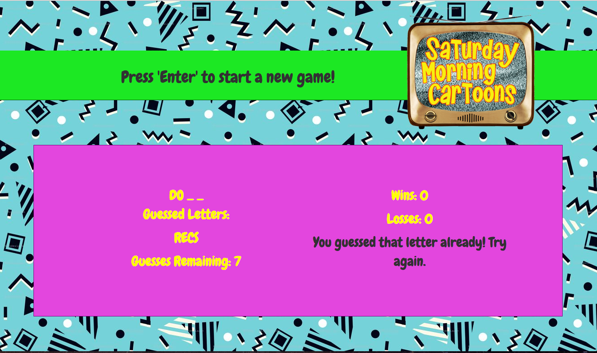

## Saturday Morning Cartoons - Hangman

Hangman game with a Saturday Morning Cartoon theme. Click enter to begin the game. Input letters until you solve the puzzle. When you solve it, it tracks your wins and plays the theme music for that cartoon until you guess the next letter for the next puzzle. Also, tracks your losses if you don't solve the puzzle in less than 12 guesses.

## Motivation

Created during Week 3 of Rutgers Coding Bootcamp. The challenge was to create a hangman game. I decided to go with a 90s Cartoon Theme and therefore designed the app with the 90s patterns and bright neon color. We were to add music (if there was time) whenever the user solved the puzzle.

## Screenshots


Starting the game.


Tracks letters guessed and lets the user know if they've already guessed a letter.

## Technologies used
- Google Fonts
- Bootstrap
- jQuery

## Getting Started 
http://cartoon-hangman.herokuapp.com/

### Prerequisites

```
- Bootstrap: visit http://getbootstrap.com/ and link in html
- Google Fonts: visit https://fonts.google.com/ and link to html. Copy code provided and implement into css file
- jQuery
```

## Built With

* Sublime Text - Text Editor
* Bootstrap - Wireframe

## Authors

* **Stefanie Ding** - *HTML/CSS/JS* - [Stefanie Ding](https://github.com/StefanieDing)

## Acknowledgments

* Thanks to Dan, Nate, and Jimmy from Rutgers Coding Bootcamp for additional help.